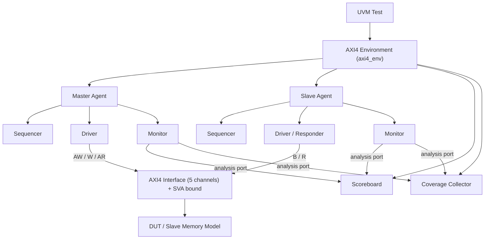

# AXI4 UVM Verification Environment

A SystemVerilog/UVM-based verification environment built to verify AXI4-protocol compliant designs. The environment implements independent Master and Slave agents, a self-checking scoreboard, protocol-level SystemVerilog Assertions (SVA) across all five AXI4 channels, and a functional coverage model — achieving **91.67% functional coverage**.
---

## Table of Contents
- [Overview](#overview)
- [Architecture](#architecture)
- [Directory Structure](#directory-structure)
- [Verification Components](#verification-components)
- [Test Scenarios](#test-scenarios)
- [Functional Coverage](#functional-coverage)
- [Technologies Used](#technologies-used)
- [How to Run](#how-to-run)
- [Results Summary](#results-summary)
- [Future Improvements](#future-improvements)
- [Author](#author)

---

## Overview

The **AXI4 protocol** (Advanced eXtensible Interface 4, part of ARM's AMBA family) is the industry-standard interconnect protocol used across nearly all modern SoCs to connect masters (CPUs, DMA engines) to slaves (memory controllers, peripherals). Verifying it thoroughly requires a reusable, layered UVM environment rather than a fixed testbench — which is exactly what this project builds.

**DUT:**  Environment includes its own reactive slave agent acting as the responder.

This project was built to develop hands-on depth in UVM methodology, AXI4 protocol semantics, and functional verification closure.

## Architecture



The five AXI4 channels — **AW** (Write Address), **W** (Write Data), **B** (Write Response), **AR** (Read Address), **R** (Read Data) — operate independently with their own VALID/READY handshake, which is what makes AXI4 verification non-trivial: channels can be arbitrarily skewed in time relative to each other, and the environment has to correctly track and correlate them.

## Directory Structure

```
axi4-uvm-verification/
├── rtl/                      # DUT / slave memory model (if included)
├── tb/
│   ├── interface/
│   │   └── axi4_if.sv        # 5-channel interface + clocking blocks
│   ├── agents/
│   │   ├── master_agent/     # master_driver, master_monitor, master_sequencer
│   │   └── slave_agent/      # slave_driver, slave_monitor, slave_sequencer
│   ├── env/
│   │   ├── axi4_env.sv
│   │   ├── axi4_scoreboard.sv
│   │   └── axi4_coverage.sv
│   ├── sequences/
│   │   ├── axi4_base_seq.sv
│   │   └── [directed / random / error-injection sequences]
│   ├── tests/
│   │   └── axi4_base_test.sv
│   └── top/
│       └── tb_top.sv
├── sva/
│   └── axi4_assertions.sv    # protocol checks, bound to axi4_if
├── docs/
│   └── coverage_report/      # exported coverage summary/screenshots
└── README.md
```

## Verification Components

| Component | Role | Why it matters |
|---|---|---|
| **`axi4_if`** | Bundles all 5 channel signals + clocking blocks/modports | Single point of connection between TB and DUT; modports enforce correct signal direction for master vs slave |
| **`axi4_transaction`** | Sequence item carrying address, data, burst type/length/size, ID, response fields, with randomization constraints | Represents one AXI4 transaction abstractly, independent of timing |
| **Master Agent** (driver, monitor, sequencer) | Drives AW/W/AR onto the interface per sequence; monitor passively samples driven activity | Models the initiator side of the protocol |
| **Slave Agent** (driver, monitor, sequencer) | Responds on B/R channels as an AXI4-compliant responder; monitor samples slave-side activity | Lets the environment self-verify independent of whether a real RTL slave is present, and is reusable against any real AXI4 slave DUT |
| **Scoreboard** | Receives transactions from both monitors via TLM analysis ports, compares expected vs. actual, flags mismatches | This is what makes the environment *self-checking* — no manual waveform inspection needed to know if a test passed |
| **Coverage Collector** | Covergroups sampling burst type, burst length, size, address ranges, response codes, and cross coverage between them | Provides an objective, quantifiable answer to "have we verified enough of the protocol space?" |
| **SVA (`axi4_assertions.sv`)** | Concurrent assertions bound to `axi4_if`, checking protocol rules independently of the scoreboard (e.g. VALID must not deassert before READY, no 4KB boundary crossing, WLAST correctness) | Catches protocol violations *live*, at the cycle they occur — complementary to the scoreboard, which checks end-to-end data correctness |

## Test Scenarios

- Single/back-to-back write and read transactions
- All burst types: FIXED, INCR, WRAP
- Boundary cases: max burst length, narrow transfers, unaligned addresses
- Concurrent outstanding transactions with different AxID
- Error-injection tests (e.g., forcing SLVERR/DECERR responses)
- Randomized constrained stress test

## Functional Coverage

**Overall functional coverage: 91.67%**


## Technologies Used

- **SystemVerilog** — OOP-based testbench, interfaces, constrained-random stimulus
- **UVM 1.2** — factory, phasing, TLM analysis ports, sequence/sequencer/driver architecture
- **SystemVerilog Assertions (SVA)** — concurrent protocol checkers
- **Functional Coverage** — covergroups, coverpoints, cross coverage
- **AXI4 Protocol** (AMBA 4 specification)
- **EDA Playground** — development and simulation platform
- **Simulator:** Cadence Xcelium.
- **Git / GitHub** — version control

## How to Run


1. Open the project on [EDA Playground](https://edaplayground.com/x/GB8k) — link: 
2. Select the simulator noted above, with UVM 1.2 library enabled
3. Run — the scoreboard reports PASS/FAIL, and the coverage summary is generated at the end of the run

## Results Summary

- ✅ Functional coverage: **91.67%**
- ✅ All SVA protocol checks
- ✅ Scoreboard: 0 mismatches across 206 transactions
- 🐛 Bugs found during verification: Clocking blocks mismatch.

## Future Improvements

- Extend coverage to exclusive access (EXOKAY) transactions
- Add out-of-order response checking across multiple outstanding IDs
- Integrate a UVM Register Abstraction Layer (RAL) model
- Add a formal-verification cross-check for a subset of SVA properties
- Support AXI4-Lite as a reduced-configuration variant

## Author

**Viswateja** — Electronics and Communication Engineering, IIT (ISM) Dhanbad
